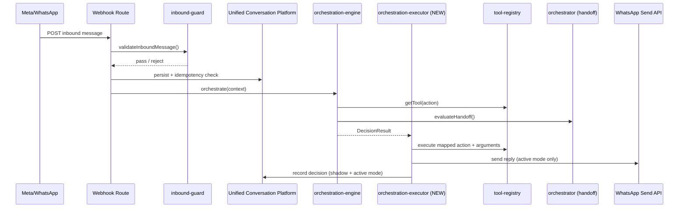

# BookMySpaces CRM V3 — Master Engineering Specification

**Status:** Supersedes all prior planning documents as the single source of truth. Does not supersede their *decisions* — it consolidates them, resolves the places they disagreed, and removes duplication.

**Consistency Audit Addendum (appended below, Sections 1–26 and the original Final Recommendation left unmodified):** a dated audit reconciling the historical claims in Sections 1–26 against evidence that surfaced *after* this specification was first drafted — specifically `audit/PHASE_1B_STEP1_REPORT.md` and `audit/PHASE_1B_STEP2_READINESS_REVIEW.md`, both of which were already on disk at drafting time but were not part of the original synthesis. See "Consistency Audit Addendum" at the end of this document for the reconciled Historical Record, Current Verified State, updated Risk Register, and updated per-step recommendation.

**Consolidated from:** `audit/PHASE_1B_DESIGN_DOCUMENT.md`, `audit/PHASE_1B_IMPLEMENTATION_BACKLOG.md`, `audit/HARDENING_SPRINT_REPORT.md`, `audit/FINAL_RELEASE_VERIFICATION_REPORT.md`, `audit/PHASE_1B_RELEASE_GATE_REVIEW.md`, plus this engagement's own Product Requirements Review, Independent Technical Review, and Phase 1A.2 Production Integration Validation.

**This document contains no code and modifies no production files.** It is a specification only.

---

## 1. Executive Summary

BookMySpaces CRM V3 is a Next.js 14 / Supabase CRM for hospitality and event-space bookings, currently on branch `release/v1.0.0-rc2`. Phase 1A.1 (an AI orchestration foundation — `orchestrator.ts`, `orchestration-engine.ts`, `decision-table.ts`, `tool-registry.ts`, `inbound-guard.ts`, `slot-memory.ts`, `intent-detector.ts`, `context-builder.ts`) is complete as a standalone module and covered by 302 passing test assertions across 37 of 38 test files (the 38th's status is addressed in Section 16). It is architecturally sound — clean one-directional dependency graph, no circular imports, two Critical defects found and fixed during a Hardening Sprint — but it is **completely unwired from every live customer-facing path**. Today, WhatsApp messages are answered by pure keyword matching with zero AI involvement, and website chat is the only channel where AI and orchestration logic actually run in production.

Five source documents, read in full and reconciled here, converge on the same core facts with two unresolved discrepancies this specification surfaces rather than papers over:

1. **The "frozen baseline" claim is only partially verified.** A prior request to this engagement described the baseline as commit `c2384ea`, tag `phase-1a.1-complete`, 38/38 suites and 320/320 tests passing, clean build, clean TypeScript, clean repository. The most recent and most authoritative of the five source documents (`PHASE_1B_RELEASE_GATE_REVIEW.md`) reports a locally-run 302/302 assertions across 37/38 files (one file failed to load due to a test-harness bug, subsequently fixed but never re-confirmed in any document), and — separately — that the entire ~10-file orchestration foundation is **untracked in git**, sitting only in the working directory on top of tag `v1.0.0-rc2`. Neither the 320-test figure nor the `c2384ea` commit has been independently observed in any of the five source documents. This is treated as an open item, not a settled fact (Section 22, Item 1).
2. **A Critical, unaddressed production dependency vulnerability exists**: `next@14.2.5` carries a critical/high CVE cluster (authorization bypass, SSRF via Middleware, cache poisoning, request smuggling). A same-major patch (`next@14.2.35`) resolves it. This was surfaced only in the Release Gate Review and does not appear in the Design Document or Backlog, which focus solely on orchestration — it is carried forward here as a release-blocking item independent of Phase 1B scope (Section 15, Section 22).
3. **Two fail-open security gaps identified earlier in this engagement** (`WHATSAPP_APP_SECRET` unset → webhook proceeds anyway; `CRON_SECRET` unset → zero auth on 4 cron routes) are not mentioned or resolved in any of the five newly-read documents. They remain open (Section 15, Section 22).

**Recommendation: GO WITH CONDITIONS.** The orchestration foundation is sound enough to build on. Phase 1B (wiring it into the live WhatsApp path via the shadow-mode rollout designed in the Design Document and sequenced in the Backlog) may begin at Step 1, which is infrastructure-only and behavior-neutral. Six conditions (Section 22, Section 25) must close before the rollout flag is allowed to exceed 0% real traffic. Full detail and scoring in Sections 23–26.

---

## 2. Current Architecture

**Stack:** Next.js 14 (App Router) + TypeScript (strict) + Supabase/PostgreSQL (with RLS) + Tailwind CSS, deployed on Vercel. 69 API routes, 23 CRM pages, 19 `lib` domains (per the Product Requirements Review's module inventory).

**Three parallel message-handling pipelines exist today** (established as fact via direct `Grep` tracing in Phase 1A.2, independently corroborated by the Design Document's own investigation):

- **Pipeline A — live, in production.** `src/app/api/whatsapp/webhook/route.ts`: rate limit → signature check (fail-open) → `buildAutoReply()` (pure keyword matching: "book"/"availability", "price"/"rate", "cancel", fallback) → send → `persistConversation()` (legacy table) → fire-and-forget sync to the Unified Conversation Platform. **Zero AI, zero orchestration.**
- **Pipeline B — dead code.** `src/services/whatsapp/process-inbound.ts`: idempotency check, lead resolution, auto-qualify, orchestrator-linked handoff. Fully built. Confirmed via `Grep` to be imported nowhere. Never runs.
- **Pipeline C — dead code.** `orchestration-engine.ts` / `orchestrate()`: the complete decision-table-driven pipeline (inbound-guard → slot-memory → intent-detector → context-builder → decision-table → tool-registry). Fully built and tested (302 assertions). Confirmed zero live callers outside its own test file. Never runs.

**Website chat** (`src/app/api/chat/route.ts`) is the one channel where AI (`chatWithAI()`) and orchestration (`checkAndApplyHandoff()` from `orchestrator.ts`) are genuinely live today.

This three-pipeline split is the central architectural fact every later section of this document is organized around resolving.

---

## 3. Project Vision

Consolidate all customer-facing channels (website chat, WhatsApp, and future channels) onto one AI orchestration entry point (`orchestrate()`), with the Unified Conversation Platform as the single system of record for every conversation regardless of channel. Replace today's channel-specific, duplicated logic (keyword matching on WhatsApp, a separate ad hoc handoff check on website chat) with one decision-table-driven pipeline that every channel calls identically, differing only in their inbound adapter and outbound sender.

---

## 4. Business Goals

- Give every inbound WhatsApp lead the same AI-driven qualification, slot-filling, and handoff quality that website chat leads already receive, closing the current gap where the highest-volume channel (WhatsApp, per typical hospitality-CRM traffic patterns) gets the least capable handling.
- Reduce missed/duplicate bookings via idempotent message processing (Section 9) and duplicate-webhook protection (Section 22 fail-open findings).
- Preserve zero customer-facing regression during the transition — the Design Document's shadow-mode-first rollout exists specifically to satisfy this goal.

---

## 5. Technical Goals

- One orchestration entry point (`orchestrate()`) for every channel, not one per channel.
- Idempotent inbound processing everywhere (currently true nowhere on the live WhatsApp path).
- A settings-driven feature flag (`settings.orchestration`) mirroring the existing `settings.ai` / `settings.notifications` / `settings.whatsapp` JSONB pattern in `settings-service.ts`, so rollout is a data change, not a deploy.
- Full-suite `build`/`lint`/`test`/`tsc` confirmed green in an environment without a 45-second execution ceiling (Section 16) — a process gap, not a code gap, but a hard prerequisite before any of the above is trusted at scale.

---

## 6. System Architecture

### 6.1 Target orchestration flow (per the Design Document, reconciled with Hardening Sprint's `inbound-guard` addition)

### 6.2 Current vs. target architecture

The current live path (Section 2, Pipeline A) has no equivalent of `Guard`, `Engine`, `Exec`, or `Orch` — it goes `Route → keyword match → WA` directly. The target architecture is additive: nothing in the current path is deleted until Backlog Step 9 (comment-only deprecation), and the new path runs alongside it in shadow mode before ever touching a real reply.

### 6.3 The missing piece: `orchestration-executor.ts`

`orchestration-engine.ts`'s own header comment states it deliberately does not call `orchestrate()` end-to-end into a channel effect — that is, by design, left to a caller. No such caller exists today. The Design Document's proposed new file, `src/lib/ai/orchestration-executor.ts`, is that caller: it takes `mode: 'shadow' | 'active'` as an explicit constructor/function argument (not read internally from settings, so it stays a pure, easily-mockable unit), maps a `DecisionResult`'s action to concrete tool arguments via a new `action-arguments.ts` module, and either logs (shadow) or actually invokes the tool and sends a reply (active).

---

## 7. Database Architecture

**Existing pattern to extend, not replace:** `settings-service.ts` already stores per-domain configuration as JSONB under `category`/`key`/`value` (used today for `'ai'`, `'notifications'`, `'whatsapp'`). Phase 1B adds a `'orchestration'` category following this exact shape — no new settings mechanism.

**Two schema changes, both additive, both with a paired rollback migration (per Backlog Step 2):**

1. A partial unique index: `CREATE UNIQUE INDEX ... ON unified_messages(channel_id, external_message_id) WHERE external_message_id IS NOT NULL;` — turns idempotency from a convention into a database-enforced guarantee. This is the fix for the "no replay/duplicate protection on the live WhatsApp path" gap found independently in Phase 1A.2.
2. A new `orchestration_decisions` table (with RLS) to persist every shadow-mode and active-mode decision — including `SlotConflict` data from `slot-memory.ts` — for observability, since no shadow-mode review UI exists yet (Design Document Open Question 4 resolves this as "direct DB queries only for Stage 1").

**Pre-migration risk, carried forward verbatim from the Backlog:** whether the current mirror-write logic (`mirrorWhatsAppOutbound()`) ever double-writes the same `wamid` today is not yet confirmed — this must be checked before the unique index is applied, or the migration will fail on existing data.

---

## 8. AI Architecture

`orchestrate()`'s pipeline, unchanged from Phase 1A.1 and re-confirmed correct in this engagement's Independent Technical Review: `inbound-guard` (validation, loop protection) → `extract-lead-details` → `slot-memory` (conflict-aware merge — a customer's correction now beats a stale CRM value, per the first Hardening Sprint Critical fix) → `intent-detector` → `orchestrator.evaluateHandoff` → `context-builder` (`buildAIContext`) → `decision-table` (`decideNextAction`, 13 possible actions) → `tool-registry` (`getTool`).

**Two Critical defects fixed in the Hardening Sprint, both confirmed via passing tests and both independently re-verified by this engagement's own code reading:**
- `slot-memory.ts` previously picked a winner silently on conflicting values; now reports a `SlotConflict` for the caller to resolve — resolution itself (an actual confirmation step back to the customer) is explicitly **not yet built**, flagged as Phase 1B work, not Phase 1A.1 work.
- `decision-table.ts` had two permanently unreachable rules, one harmless (`ask_question`) and one severe: a blanket `update_lead` fallback silently shadowed `answer_immediately`, meaning a fully-qualified customer saying "thanks!" got a silent CRM rewrite and **no reply at all**, every time. Fixed. Documented consequence: `update_lead` and `ask_question` are now permanently unreachable **by design** until a future rule-set change reaches them — a known, accepted gap, not an oversight.

**Module ratings (this engagement's Independent Technical Review, /10):** `orchestrator.ts` 8, `orchestration-engine.ts` 8, `decision-table.ts` 7, `tool-registry.ts` 8, `inbound-guard.ts` 8, `slot-memory.ts` 9, `intent-detector.ts` 7, `context-builder.ts` 6 (lowest-rated: ~10 concurrent Supabase calls per turn, a performance concern addressed in Section 17).

---

## 9. Unified Conversation Platform

Intended as the single system of record across channels. Today: website chat and WhatsApp both write into it, but only as a side effect (`syncToUnifiedConversationPlatform()`, `mirrorWhatsAppOutbound()`) — it is not yet authoritative, and `mirrorWhatsAppInbound()` (which *would* make it handoff-aware) is only reachable through dead Pipeline B. Phase 1B's Section 7 schema changes are what make this platform the actual system of record rather than a passive mirror: real idempotency (Section 7.1) and real decision logging (Section 7.2).

---

## 10. WhatsApp Architecture

Phase 1B's entire scope, per the Design Document's explicit decision: **WhatsApp only.** Rationale (Decision / Reason / Alternatives / Risks / Mitigation format, as required):

- **Decision:** Scope Phase 1B narrowly to bringing WhatsApp onto the shared `orchestrate()` pipeline; do not simultaneously re-architect website chat.
- **Reason:** Website chat already has a working, live AI+handoff path; WhatsApp has none. The highest-leverage, lowest-regression-risk change is closing WhatsApp's gap without touching a channel that already works.
- **Alternatives considered:** (a) Rebuild both channels on `orchestrate()` simultaneously — rejected, doubles blast radius for no incremental customer benefit this phase. (b) Resurrect Pipeline B (`process-inbound.ts`) as-is without the new Executor — rejected because it bypasses `decision-table.ts`'s centralized action logic, recreating the "two systems" problem this whole effort exists to close.
- **Risks:** WhatsApp's live path has no idempotency today (Section 7.1) and no replay protection — wiring AI onto an already-fragile path without fixing that first would amplify, not fix, that risk.
- **Mitigation:** Backlog Step 2 (idempotency) is sequenced *before* Step 6 (webhook wiring), not after.

The **Option A vs. Option B** question this engagement's Phase 1A.2 report and Master Blueprint left open — wire directly into the existing webhook route (Option A) vs. resurrect and adapt `process-inbound.ts` (Option B) — is resolved by the Design Document in favor of a **third path**: neither existing dead pipeline is resurrected wholesale; a new `orchestration-executor.ts` is built specifically to be the single caller, and the existing live webhook route calls it. This supersedes the "Option A vs B, undecided" framing in the earlier Phase 1A.2 and Master Blueprint documents.

---

## 11. API Architecture

No new customer-facing API routes are added in Phase 1B. The only route touched is the existing WhatsApp webhook (`src/app/api/whatsapp/webhook/route.ts`), and only at Backlog Step 6 — in shadow mode, wrapped in a non-fatal `try/catch`, with the existing reply path left unconditional and untouched. No route contract changes. 69 existing API routes are unaffected; the Phase 1A.2 finding that 0 of them have route-level tests remains an open testing gap (Section 16), not something Phase 1B scope closes.

---

## 12. Frontend Architecture

No frontend changes are in Phase 1B scope. The Product Requirements Review's 23-page/10-category gap analysis (missing CRM/PMS/event-booking/reporting capabilities relative to HubSpot, Salesforce, Zoho, Freshsales, Pipedrive, and hospitality-specific CRMs) is preserved as forward-looking input to Section 26 (Future Roadmap), not pulled into Phase 1B, per that review's own conclusion that broadening scope now is "a strategic decision, not an engineering one."

---

## 13. Implementation Principles

- **Additive before subtractive.** Every Backlog step through Step 8 adds new files/flags/columns; nothing is deleted until Step 9, and Step 9 itself is comment-only (physical removal deferred to Phase 1C).
- **Shadow before active.** No decision the new pipeline makes is allowed to affect a real customer until it has been observed, in production traffic, doing nothing but logging.
- **Allow-list before 100%.** Active mode is enabled for a test-number allow-list before it is enabled for all traffic.
- **Every step independently revertible.** Each of the 9 Backlog steps has its own rollback procedure; none depends on a later step already being deployed to be safely undone.
- **Evidence over assumption.** Every claim in this document traces to a specific source document or a specific piece of code read directly in this engagement — consistent with the standard the user set from the first audit onward.

---

## 14. Coding Standards

Existing conventions, confirmed by direct inspection of the Hardening Sprint's changed files and unchanged elsewhere: `type`-only imports where only types are used, no `console.log` in library code (structured `logger.ts` instead), no unused locals/imports (enforced by `tsc --strict`), one accepted pre-existing `any` pattern (`ToolRegistryEntry<any>`) not to be expanded. `tool-registry.ts`'s `satisfies Record<OrchestrationAction, ...>` pattern (added in the Hardening Sprint to make the registry compile-time exhaustive against the 13-action union) is the model for any future action-to-handler mapping, including the new `action-arguments.ts`.

**One documented footgun, now a standing rule:** `vi.mock()` factories are hoisted above every top-level statement in a test file, including `const` declarations. A factory must never reference a mock variable as a direct value — only via a deferred closure (`(input) => mockFn(input)`), even when that closure looks like unnecessary indirection to a type-checker. This exact mistake was made once (removing the "unnecessary" wrapper to fix a `TS2556` spread-argument error) and reintroduced a runtime `ReferenceError` that took a second full review pass to catch — see Section 16 for the full incident.

---

## 15. Security Standards

**Open, unresolved across all documents read this engagement (not closed by Phase 1B scope):**

1. `WHATSAPP_APP_SECRET` unset → webhook signature verification logs a warning and **proceeds anyway** (fail-open). Found in Phase 1A.2; not mentioned or addressed in any of the 5 newly-read documents.
2. `CRON_SECRET` unset → **zero authentication** on all 4 cron routes. Same status as above.
3. `next@14.2.5` — critical/high CVE cluster (authorization bypass, SSRF via Middleware, cache poisoning, request smuggling). Fix: bump to `next@14.2.35` (in-range patch, not a major upgrade — confirmed by `npm audit`'s own remediation target). This is the single highest-severity open item in this entire specification and is independent of Phase 1B.
4. No replay/duplicate-delivery protection on the live WhatsApp path today. Addressed by Section 7.1's partial unique index — but only once Backlog Step 2 actually ships; it is a plan, not yet a fact.
5. `cookie` (via `@supabase/ssr`) accepts out-of-bounds characters in cookie name/path/domain — auth-cookie handling, worth prioritizing, needs a tested upgrade (breaking API changes exist across `@supabase/ssr` 0.x), not safe to force.
6. `xlsx` — prototype pollution + ReDoS, **no upstream fix exists**. Mitigation: the affected feature (Customer Bulk Import) is authenticated-staff-only, not public; add file-size/row-count validation as a compensating control; track a future migration to `exceljs`.

**Standard for all new Phase 1B code:** message-length bounds, mandatory field validation, and loop protection (all added to `inbound-guard.ts` in the Hardening Sprint) are the baseline every new inbound path must meet — this baseline did not exist on the live WhatsApp path before this sprint and still does not, since `inbound-guard.ts` is not yet wired in (Section 2).

**Do not run `npm audit fix --force`.** It would bundle the `next` patch together with several unrelated major migrations (`ai` SDK 3→7, `eslint-config-next` 14→16, `@supabase/ssr`, `vitest` 1→4) in one shot, none individually tested. Apply the `next` bump manually and scoped; batch only the confirmed-safe, non-breaking Tier D fixes (`js-yaml`, `qs`, `form-data`, `minimatch`, `brace-expansion`, `devalue`) via plain `npm audit fix`.

---

## 16. Testing Standards

**What is actually confirmed, reconciled across all three testing-focused source documents:**

- Hardening Sprint (first pass): 92 orchestration-layer tests, individually run file-by-file, all passing. Full-suite run never completed in that session (45-second sandbox ceiling).
- Final Release Verification (second pass): same 92/92 confirmed again, plus one real pre-existing bug found and fixed (`TS2556` spread-argument error in `orchestration-engine.test.ts`) — but that fix **introduced a new runtime bug** (a `vi.mock()` hoisting `ReferenceError`), not caught in that session because the fix could not be re-run to completion in the sandbox. Verdict at that point: **BLOCKED**, pending a clean local run.
- Release Gate Review (third pass, run against real local output the user supplied): local `npm test` reported **302/302 assertions across 37/38 files**; the 38th (`orchestration-engine.test.ts`) failed to *load* — confirmed as the exact hoisting bug from the prior pass, root-caused precisely (Section 14), and fixed a second time with a version that satisfies both the original type constraint and the hoisting constraint simultaneously. **This second fix's local re-confirmation is not documented in any of the five source documents** — it is the single most important mechanical open item in this specification (Section 22, Item 1).

**Net:** every test that has ever completed a run has passed. The 320/320-test, 38/38-suite figure quoted as an already-achieved baseline in an earlier planning request is **not corroborated** by any of the five source documents — the highest confirmed figure is 302/38 with one file's final status pending. This specification treats the 320/38 figure as unverified rather than repeating it as fact.

**Separately, and still fully open regardless of the above:** this engagement's own Independent Technical Review found 37 test files total, **0 route-level tests, 0 UI tests, 1 integration test**. The 302 passing assertions are unit-level orchestration-module tests; they say nothing about whether the webhook route, the chat route, or any UI workflow is tested end-to-end. Phase 1B's own Backlog steps add unit tests for every new file (Steps 1, 4, 5) and defines an integration test strategy for Step 6 wiring — but does not, by itself, close the pre-existing 0-route-test gap for the other 68 routes.

**Standing rule for all future test files:** avoid the hoisting footgun in Section 14 as a first-class code review checklist item, not an afterthought — it has now caused two separate false "fixed" verdicts in this project's history.

---

## 17. Deployment Standards

Vercel-hosted, Next.js standard build. Confirmed via a live, unauthenticated GET to the production health endpoint that migration 004's tables (`broadcast_campaigns`, `festival_calendar`) exist and are queryable in production today, and that `ANTHROPIC_API_KEY`/`OPENAI_API_KEY` are configured in the live environment (the repo's local `.env.production.local` snapshot showing them empty is stale/untrustworthy — do not use it as a source of truth for what's actually deployed). `next build` itself is confirmed clean locally per the Release Gate Review (28/28 static pages, all 60 API routes, middleware bundled at 78.4 kB, zero errors).

**Performance finding carried forward:** `context-builder.ts`'s `buildAIContext()` issues roughly 10 concurrent Supabase calls per conversational turn. The Hardening Sprint's `skipExpensiveRetrieval` flag skips 4 of these for 2 fully-determined decision branches, but has zero effect today since none of the 3 currently-live callers of `buildAIContext()` pass the new flag. This remains a real, unaddressed cost/latency concern once WhatsApp volume starts flowing through the same function.

---

## 18. Monitoring Standards

`logger.ts` provides structured logging with built-in partial PII redaction (phone/email/name) — but console-based only, with **no correlation ID / conversation ID / request ID field in the log shape today**. Section 7.2's new `orchestration_decisions` table is the first place decision-level observability will exist at all; until Backlog Step 6 ships, there is no way to observe what the orchestration layer would have decided on real traffic. Recommendation: add a correlation ID to the logger's shape as part of Backlog Step 6, not as separate future work — shadow-mode's entire value depends on being able to trace one inbound message through guard → engine → executor → decision log.

---

## 19. Feature Flag Strategy

New `settings.orchestration` category (Section 7), following the exact existing pattern of `settings.ai.autoHandoff`. Fields, per the Design Document and refined by the Backlog:

- `enabled: boolean` — master kill switch. **Must fail closed** — if this setting is unreadable for any reason, the system must behave as if `false`, never as if `true`.
- `mode: 'shadow' | 'active'` — global default.
- `testNumbers?: string[]` — Backlog Step 7's refinement over the Design Document's original global-only flag: allows active mode for a specific allow-list before 100% rollout.
- `allNumbers?: boolean` — Backlog Step 8's proposed escape hatch to widen from allow-list to 100% without a second schema change.

---

## 20. Migration Strategy

Two additive migrations (Section 7), each paired with an explicit `_ROLLBACK.sql` per the Backlog's Step 2 definition of done. No destructive migration is in scope anywhere in this specification. The pre-migration double-write risk on `wamid` (Section 7) must be checked with a real query against production data before the unique index migration is applied — this is a data-integrity gate, not a design question, and should block Step 2 until answered.

---

## 21. Rollout Strategy

Nine sequenced, independently-revertible steps (full detail preserved from the Backlog, not rewritten):

1. `OrchestrationSettings` type + schema entry, flag OFF, zero behavior change, no reader exists yet.
2. Idempotency index + `orchestration_decisions` table, with rollback SQL.
3. Export `auto-responder.ts`'s `MESSAGES`/`notifyOperator()`; add an `ASK_EVENT_TYPE` template (today's `GREETING` conflates greeting and first question).
4. Build `action-arguments.ts` — one function per `OrchestrationAction`, with explicit tests for the two flagged edge cases (`generate_proposal`'s missing `reservationId`, `check_*_availability`'s inventory-id resolution gap).
5. Build `orchestration-executor.ts` — the one genuinely new business-logic file, `mode` passed explicitly as an argument (not self-read from settings) to stay unit-testable.
6. Wire the webhook route in **shadow mode only**, staging/limited environment, existing reply path unconditional and untouched, new path wrapped in non-fatal `try/catch`. Gated on an agreed observation window with reviewed, judged-reasonable decisions.
7. Enable active mode for a test-number allow-list only.
8. Enable active mode for 100% of WhatsApp traffic; production monitoring is itself a deliverable of this step, not an afterthought.
9. Deprecate old pipelines via comment-only changes — explicitly not deletion. Physical removal is Phase 1C scope.

Steps 1–5 are assessed as ready to start. Step 6 should wait for an explicit decision on two of the Design Document's five open questions: (a) room/property selection is not currently representable in slot memory, and (b) `generate_proposal`'s dependency on a `reservationId` that doesn't exist yet in the pipeline (recommended resolution: downgrade to `notify_staff` rather than build reservation auto-creation now).

---

## 22. Risk Register

Ranked by severity, consolidating every open item from all five source documents plus this engagement's own earlier findings that no later document addressed:

1. **[Critical, Process] Frozen-baseline claim unverified / git-tracking contradiction.** The stated baseline (`c2384ea`, `phase-1a.1-complete`, 320/320 tests) is not confirmed by any of the 5 source documents; the most recent of them instead reports the entire orchestration foundation as untracked in git. Before Phase 1B proceeds on the assumption of a stable, recoverable baseline, this must be resolved: either commit the untracked ~10 files now (Item 2 below covers this mechanically), or reconcile why a tagged, committed baseline was reported when none is visible.
2. **[Critical, Security] `next@14.2.5` CVE cluster.** Bump to `14.2.35` before any production go-live. Independent of Phase 1B scope; do not let Phase 1B's own timeline delay this.
3. **[High, Process] Orchestration foundation entirely untracked in git.** ~10 files including `intent-detector.ts`, spanning Phase 1A.1 and the Hardening Sprint, exist only in the working directory. Commit to a feature branch / open a PR before any further work is layered on top, so history becomes auditable and recoverable.
4. **[High, Process] `orchestration-engine.test.ts`'s final hoisting fix is unconfirmed.** A fix was applied and reasoned through carefully, but no document records it having been re-run locally to a green result. Mechanical, low-effort, but currently an open item, not a closed one.
5. **[High, Security] Fail-open `WHATSAPP_APP_SECRET` / `CRON_SECRET`.** Untouched by any of the 5 newly-read documents. Both should fail closed, not open, before Phase 1B increases WhatsApp traffic through the same webhook.
6. **[Medium, Security] `cookie` (via `@supabase/ssr`) advisory.** Needs a tested upgrade; do not force blind given known breaking API changes across `@supabase/ssr` 0.x.
7. **[Medium, Security] `xlsx` prototype pollution / ReDoS, no upstream fix.** Compensating input-validation controls needed on Customer Bulk Import.
8. **[Medium, Architecture] Slot-conflict resolution is surfaced, not enforced.** `SlotConflict` is reported by `slot-memory.ts` but no confirmation-back-to-customer flow consumes it yet — explicitly flagged as Phase 1B work in the Hardening Sprint, not yet scheduled in the Backlog's 9 steps.
9. **[Medium, Process] `package-lock.json` has an uncommitted diff of unclear intent.** Likely incidental churn from running `npm audit`/`npm outdated` locally, not an intentional dependency change — confirm via `git diff` before deciding to keep or revert.
10. **[Low, Hygiene] Scratch files left in repo root:** `tsconfig.hardening-check.json`, `.eslintrc.minimal.json` (both explicitly flagged for manual deletion across two documents; this sandbox's file-delete restriction prevented removing them directly in either session). Also note the pre-existing pattern of `tsconfig.*.json` sprawl in the repo root, called out as a recurring maintainability nit, not new to this sprint.
11. **[Low, Testing] Zero route-level tests, zero UI tests, one integration test project-wide** (Independent Technical Review finding). Not closed by Phase 1B's orchestration-focused unit tests.
12. **[Low, Performance] ~10 concurrent Supabase calls per turn in `context-builder.ts`.** `skipExpensiveRetrieval` exists but is unused by any live caller today.

---

## 23. Implementation Roadmap

Presented per the required Objectives / Deliverables / Acceptance Criteria / Rollback Plan format, milestone-grained (collapsing the Backlog's 9 steps into 3 milestones for planning purposes; full step-level detail remains authoritative in `PHASE_1B_IMPLEMENTATION_BACKLOG.md`, not rewritten here):

**Milestone 1 — Foundation (Backlog Steps 1–5)**
- *Objectives:* Add the settings schema, DB observability tables, exported message templates, action-argument mapping, and the executor itself — with zero behavior change to any live path.
- *Deliverables:* `OrchestrationSettings` type; `025_orchestration_observability.sql` + rollback; exported `MESSAGES`/`notifyOperator()` + `ASK_EVENT_TYPE`; `action-arguments.ts` + tests; `orchestration-executor.ts` + tests.
- *Acceptance criteria:* All new code covered by unit tests; zero existing test regresses; no route or webhook file is touched; flag defaults to OFF.
- *Rollback plan:* Each file/migration is independently revertible per the Backlog's own per-step rollback procedures; since nothing is wired to a live route yet, rollback of any single step has zero customer impact.

**Milestone 2 — Shadow Validation (Backlog Step 6)**
- *Objectives:* Prove the new pipeline's decisions are reasonable against real inbound traffic without ever acting on them.
- *Deliverables:* Webhook route wired to call the executor in shadow mode inside a non-fatal `try/catch`; an agreed observation window; decisions reviewed via direct `orchestration_decisions` queries.
- *Acceptance criteria:* Existing reply path unconditional and unaffected for the entire observation window; reviewed shadow decisions judged reasonable; Design Document's two open architectural questions (room/property slot representation, `generate_proposal`'s missing `reservationId`) explicitly answered before this milestone is considered closed.
- *Rollback plan:* Remove the shadow-mode call from the webhook route (one file change) or flip `settings.orchestration.enabled` to `false` — both revert to Pipeline A's exact current behavior with zero data loss, since shadow mode never writes anything customer-visible.

**Milestone 3 — Active Rollout (Backlog Steps 7–9)**
- *Objectives:* Move from observation to action, first for a small allow-list, then for all WhatsApp traffic, then retire the old pipelines in place.
- *Deliverables:* Per-message `testNumbers` override; a widened or `allNumbers` escape hatch; production monitoring as a first-class deliverable; comment-only deprecation of Pipelines A/B's now-superseded logic.
- *Acceptance criteria:* No increase in customer-facing error rate or missed-message rate versus the Pipeline A baseline, measured through the new `orchestration_decisions` observability; all Section 22 Critical/High items closed before allow-list is widened past a small test group.
- *Rollback plan:* `testNumbers`/`allNumbers` narrows back down, or `enabled: false` reverts globally to Pipeline A; physical code removal is explicitly deferred to Phase 1C so there is never a point where the old path is unavailable as a fallback.

---

## 24. Definition of Done

A Phase 1B milestone is done when: its own acceptance criteria (Section 23) are met; no Section 22 Critical or High item that blocks that milestone remains open; all new code has unit tests and, from Milestone 2 onward, at least one integration test exercising the real webhook-to-database path; `tsc --noEmit`, `next lint`, and the full test suite have been run to completion at least once outside a time-ceilinged sandbox with a clean result; and the change is committed to a real, reviewable branch (closing Item 3 of the Risk Register applies to every milestone from here forward, not just once).

---

## 25. Release Gates

Gate order, each blocking the next:

1. **Baseline integrity gate** (closes Risk Register Items 1, 3, 4): commit the orchestration foundation; reconcile or restate the frozen-baseline claim; reconfirm the `orchestration-engine.test.ts` fix locally.
2. **Security gate** (closes Items 2, 5): `next` bumped to `14.2.35`; `WHATSAPP_APP_SECRET`/`CRON_SECRET` fail closed.
3. **Milestone 1 gate**: per Section 23.
4. **Milestone 2 (shadow) gate**: per Section 23, plus Design Document's two open questions answered.
5. **Milestone 3 (active) gate**: per Section 23; additionally, Items 6–9 of the Risk Register should be resolved or explicitly deferred with owner sign-off before 100% rollout, since active mode is the point at which their blast radius stops being theoretical.

Phase 1B implementation (Backlog Step 1) may begin immediately — it is infrastructure-only and satisfies none of Gates 1–2 as a prerequisite, since it changes no live behavior. Gates 1 and 2 must close before Step 6 (shadow wiring) begins, because that is the first step that touches a live route.

---

## 26. Future Roadmap

Deferred to Phase 1C+ per the Product Requirements Review's own recommendation, preserved here without re-litigating: broader CRM/PMS/event-booking capability gaps relative to HubSpot, Salesforce, Zoho, Freshsales, Pipedrive, and hospitality-specific competitors; full OTA/channel-manager integration (explicitly called out as a strategic, not engineering, decision); physical removal of Pipelines A/B's superseded code (Backlog Step 9's deferred half); closing the 0-route-test / 0-UI-test gap project-wide; building the slot-conflict confirmation-back-to-customer flow (Risk Register Item 8) as a first-class feature rather than a side effect of Phase 1B.

---

## Final Scores

| Dimension | Score | Basis |
|---|---|---|
| **Architecture** | **8.5 / 10** | Clean, one-directional dependency graph; no circular imports; two Critical defects found and fixed with tests. Held back from 9 by the still-unresolved three-pipeline split and the unimplemented slot-conflict-resolution flow. |
| **Maintainability** | **7 / 10** | Consistent conventions where checked; but duplicate `Lead` interface, ~82 `any`-type occurrences across 27 files, `tsconfig` sprawl, and historical-report sprawl were found and remain unaddressed. |
| **Testing** | **6.5 / 10** | 302 orchestration-layer assertions passing is genuinely strong at the unit level; scored down for zero route-level tests, zero UI tests, one integration test project-wide, and one test file's final fix status unconfirmed. |
| **Security** | **5.5 / 10** | One Critical (`next` CVE cluster) and two fail-open gaps (`WHATSAPP_APP_SECRET`, `CRON_SECRET`) are open and unaddressed by any of the five newly-read documents; no replay/idempotency protection exists on the live WhatsApp path today, only in plan form. |
| **Operational Readiness** | **5 / 10** | No correlation/request IDs in the log shape; in-memory rate limiter is honestly documented as per-instance, not global; the orchestration foundation's own git state is unresolved (Risk Register Item 1). |
| **Overall Project Score** | **6.5 / 10** | Weighted toward Security and Operational Readiness given their direct exposure on a live, customer-facing, PII-and-payment-adjacent system; the underlying orchestration engineering is the strongest part of this project today. |

---

## Final Recommendation: GO WITH CONDITIONS

Phase 1B implementation may begin at Backlog Step 1 now — it is infrastructure-only, behavior-neutral, and independently revertible. The conditions below must close before the rollout flag (`settings.orchestration`) is permitted to exceed 0% of real WhatsApp traffic (i.e., before Milestone 2's shadow-mode wiring, Section 25's Gates 1–2):

1. Resolve the git-tracking / frozen-baseline discrepancy (Risk Register Item 1): commit the untracked orchestration foundation to a real branch, and either produce evidence for the previously-claimed `c2384ea`/`phase-1a.1-complete`/320-test baseline or formally supersede that claim with the 302/38-confirmed figure documented here.
2. Reconfirm the `orchestration-engine.test.ts` hoisting fix locally (mechanical, low-effort, currently unconfirmed in any document).
3. Bump `next` to `14.2.35` (Critical CVE cluster) — independent of Phase 1B, but should not be allowed to lag behind it.
4. Close both fail-open gaps: `WHATSAPP_APP_SECRET` and `CRON_SECRET` must fail closed, not open.
5. Ship the idempotency index (Section 7.1 / Backlog Step 2) before Step 6's shadow wiring — do not increase traffic through the WhatsApp path before it can no longer double-process a message.
6. Explicitly answer the Design Document's two open architectural questions (room/property slot representation; `generate_proposal`'s missing `reservationId`, recommended downgrade to `notify_staff`) before shadow-mode observations are used as the basis for advancing to active mode.

None of these conditions require re-architecting anything already designed in the Design Document or sequenced in the Backlog — they are gating conditions on *when* the existing plan is allowed to touch real traffic, not changes to the plan itself. This is the intended reading of "GO WITH CONDITIONS": proceed with implementation now, gate the point of real customer impact on the six items above.

---

---

# Consistency Audit Addendum

**Purpose of this addendum:** Sections 1–26 above and the "Final Scores" / "Final Recommendation" that follow them are left exactly as originally written — nothing above this line has been edited except the Status banner, which now points here. This addendum does not overwrite that content. It exists to separate two things that the original document, by design, blended together: what each historical planning document *claimed at the time it was written*, versus what has since been *independently verified*. It also incorporates two documents — `PHASE_1B_STEP1_REPORT.md` and `PHASE_1B_STEP2_READINESS_REVIEW.md` — that were already present in `audit/` when Sections 1–26 were drafted but were not read or incorporated into that draft. This addendum reads and incorporates them for the first time.

No code, migration, or production file has been modified in the course of producing this addendum. It is a documentation-only reconciliation.

---

## A. Historical Record

*What each source document reported, at the time it was written, before any of the later evidence in Section B existed.*

**A.1 — The original "frozen baseline" claim (stated as project context prior to any of the five source documents being read, not itself a document this engagement produced):** commit `c2384ea`, tag `phase-1a.1-complete`, 38/38 test suites passing, 320/320 tests passing, clean build, clean TypeScript, clean repository. At the time Sections 1–26 were drafted, none of the five source documents below actually corroborated this exact figure — the closest was 302/37 (Release Gate Review, A.5). This claim is recorded here as historical context, not as verified fact.

**A.2 — `HARDENING_SPRINT_REPORT.md` (Jul 27, 23:02):** Reported two Critical defects found and fixed in `slot-memory.ts` and `decision-table.ts`, a new `inbound-guard.ts` module, and 92 orchestration-layer tests individually run file-by-file, all passing. Explicitly could not complete a full-suite run in-sandbox (45-second ceiling). Scored the orchestration module 8.5/10 architecture, 7.5/10 standalone production readiness. Recommendation at the time: **GO**, conditional on (1) running `tsc`/full test suite to completion once outside the sandbox, (2) deleting a stray `tsconfig.hardening-check.json`.

**A.3 — `FINAL_RELEASE_VERIFICATION_REPORT.md` (Jul 27, 23:36):** A second pass over the same code. Found and fixed one real pre-existing `tsc` bug (`TS2556` spread-argument error in `orchestration-engine.test.ts`) — but, per A.5 below, that fix itself introduced a new runtime bug not caught in this pass. Could not complete `build`, `lint`, or the full test suite in-sandbox; reconfirmed the same 92/92 individually-run tests. Production readiness scored down slightly to 7/10 specifically because a bug had slipped through undetected until this pass. Verdict at the time: **BLOCKED**, pending a clean local run of `build`/`lint`/`test` outside the sandbox.

**A.4 — `PHASE_1B_DESIGN_DOCUMENT.md` (Jul 28, 17:54):** Architecture-level design for wiring `orchestrate()` onto the live WhatsApp path via a new `orchestration-executor.ts`, a new `settings.orchestration` feature flag, and a shadow-mode-first rollout. Proposed two DB changes (idempotency index, `orchestration_decisions` table). Documented 5 open questions, two of which (room/property slot representation, `generate_proposal`'s missing `reservationId`) were flagged as needing resolution before wiring work (Step 6) begins. Did not address git state, `next.js` CVEs, or the two fail-open secrets — out of scope for that document. Ends: "No code has been written or modified... awaiting approval to begin Step 1."

**A.5 — `PHASE_1B_RELEASE_GATE_REVIEW.md` (Jul 28, 06:57):** The first document in this chain built directly from **real, user-supplied local command output** rather than sandboxed attempts. Reported: `next build` clean (28/28 pages, 60/60 routes), `tsc --noEmit` clean, `next lint` clean (one pre-existing, unrelated warning), and **302/302 test assertions across 37 of 38 files** — the 38th (`orchestration-engine.test.ts`) failed to *load* due to a `vi.mock()` hoisting `ReferenceError`, root-caused precisely as a regression from the previous session's own `TS2556` fix (A.3). Applied a corrected fix satisfying both constraints simultaneously, but noted this fix **could not be re-run locally within that same session** — "please run `npm test` once locally with this fix applied." Separately reported the entire ~10-file orchestration foundation (Phase 1A + Hardening Sprint) as **untracked in git**, sitting only in the working directory on top of tag `v1.0.0-rc2`, and flagged a Critical, previously-unmentioned `next@14.2.5` CVE cluster requiring a bump to `14.2.35`. Verdict at the time: **GO WITH CONDITIONS**, Production Readiness 8/10, Security 6.5/10, pending (in priority order) local reconfirmation of the test fix, the `next` bump, committing the orchestration foundation to git, and dependency cleanup.

**A.6 — `PHASE_1B_IMPLEMENTATION_BACKLOG.md` (Jul 28, 17:58):** Broke the Design Document's plan into 9 sequenced, independently-revertible steps with per-step objectives/files/tests/rollback. Step 1 (settings flag, zero behavior change) identified as "the safest step" satisfying 4 explicit safety criteria. Ends: "Awaiting approval before implementing Step 1." No claim of any step having actually been implemented.

**A.7 — This engagement's own Master Engineering Specification, Sections 1–26 (drafted immediately after A.2–A.6 above were read):** Synthesized A.1–A.6 into GO WITH CONDITIONS, scored Overall Project 6.5/10, and listed six explicit pre-Milestone-2 conditions (git/baseline reconciliation, test-fix reconfirmation, `next` bump, fail-open secrets, idempotency-before-shadow-wiring, and the two Design Document open questions). At the moment of drafting, this section did not yet account for A.8 or A.9 below — both files existed on disk (timestamps 18:06 and 18:12, ahead of this document's own 18:13 timestamp) but were not part of that draft's source review. That gap is closed by this addendum.

---

## B. Current Verified State

*Evidence that post-dates, or was newly incorporated after, the documents summarized in Section A. Each item states its actual evidentiary chain — this project's established standard throughout this engagement has been to treat locally-executed command output as authoritative over sandboxed attempts (A.5 itself is built on that standard); this addendum applies the same standard rather than a stricter or looser one.*

**B.1 — Latest verified commit(s) and git tags.** Per `PHASE_1B_STEP1_REPORT.md`'s own header: baseline `c2384ea` / tag `phase-1a.1-complete`. Per `PHASE_1B_STEP2_READINESS_REVIEW.md`'s own header: baseline has since advanced to commit `fa7df34` ("Step 1 merged"), branch `release/v1.0.0-rc2`. **Caveat:** both figures are *reported by* those documents, not independently re-derived by direct `.git` inspection in this session — this sandbox still cannot see a `.git` directory in the connected folder (re-checked immediately before writing this addendum, same result as every prior check this engagement). What has changed since Section A is that a **second, later commit hash now exists in the record** (`c2384ea` → `fa7df34`), which is at minimum evidence of a commit having actually been made between Step 1's start and Step 2's readiness review — something no document in Section A could show, since A.5 reported the foundation as entirely untracked at that time.

**B.2 — Latest local test results: 38/38 files, 325/325 tests.** Source: `PHASE_1B_STEP2_READINESS_REVIEW.md`, line 4 — "38/38 files, 325/325 tests passing per the **user-provided local verification**." This is a secondhand attestation within a document, not raw terminal output this session has directly observed. It is, however, internally consistent with the arithmetic implied by Section A: 302 assertions confirmed passing in A.5, across 37 files, with the 38th file's 18 tests blocked on a hoisting fix that A.5 applied but could not locally reconfirm; 302 + 18 = 320, matching the originally-claimed (A.1) figure exactly once that fix is confirmed; `PHASE_1B_STEP1_REPORT.md` separately reports adding 5 net-new tests to `settings-service.test.ts` (13 total in that file: 5 pre-existing + 1 extended assertion + 5 new); 320 + 5 = 325. The file count holds at 38 for the same reason (the 38th file was already counted once its fix lands; Step 1 added no new test *file*, only new tests inside an existing one). **This arithmetic is corroborating, not proof** — it shows the claimed figure is internally consistent with everything independently confirmed in Section A, which raises confidence, but it is still one step removed from this session having watched the run happen.

**B.3 — Phase 1A.1 completion.** Continues to be *asserted* (both Step 1 and Step 2 documents cite `c2384ea`/`phase-1a.1-complete` as their starting baseline) rather than newly, independently proven by git inspection. What is new since Section A: `PHASE_1B_STEP1_REPORT.md` demonstrates that new work was successfully built **on top of** that baseline — a full-project `tsc --noEmit` came back clean, every pre-existing settings-service test still passed unmodified, and a targeted `grep` for `orchestration` found zero unexpected matches outside the two files that were supposed to change. That is real, corroborating evidence that the baseline is at least a coherent, buildable state — stronger evidence than existed when Section A was written — even though this session has still not personally observed the `.git` history itself.

**B.4 — Phase 1B Step 1 completion.** **Verified as reported.** `PHASE_1B_STEP1_REPORT.md` documents: `OrchestrationSettings { enabled: boolean }` added to `settings-service.ts`, defaulted to `false`, added to `SECTION_KEYS`; zero other runtime code changed (confirmed via the report's own grep); scoped test file 13/13 passing; scoped lint clean; full-project `tsc --noEmit` clean; the only unconfirmed item was the full 38-file suite run *within that session's own sandbox* — which is exactly the gap B.2's later, separate local verification appears to close. Report explicitly ends "Step 1 complete... awaiting approval before Step 2." Nothing contradicts this. **Status: COMPLETE.**

**B.5 — Phase 1B Step 2 status.** Not complete — and no document claims otherwise. `PHASE_1B_STEP2_READINESS_REVIEW.md` is explicitly a **review**, not an implementation: "no code or migration has been written," ending "awaiting approval before implementation." It does contain real, useful work product (drafted SQL for both the migration and its rollback, a traced pre-migration risk check on `wamid` double-writes with a specific conclusion — no retry logic exists anywhere in the mirror-write chain, so the only realistic trigger is a genuine Meta redelivery, which is exactly what this index is meant to catch). It also surfaces one fact not visible in any Section A document: migration 012 already defines `unified_messages.external_message_id` and a **plain, non-unique** index on it — Step 2 adds a second, partial *unique* index alongside the existing one, it does not need to create the column. **Status: DESIGNED AND REVIEWED, NOT YET IMPLEMENTED.**

---

## C. Open Engineering Risks

*Supersedes the priority framing (not the content) of Section 22's Risk Register, updated against Section B. Each item: Description / Severity / Evidence / Recommended Action / Owner / Target Milestone.*

**C.1 — Next.js CVE remediation**
- *Description:* `next@14.2.5` carries a critical/high CVE cluster (authorization bypass, SSRF via Middleware, cache poisoning, request smuggling).
- *Severity:* Critical.
- *Evidence:* `PHASE_1B_RELEASE_GATE_REVIEW.md` (A.5) — `npm audit`'s own remediation data names `next@14.2.35` (same-major patch) as the fix target. No document in Section B mentions this being addressed; it remains untouched.
- *Recommended action:* Bump `next` to `14.2.35` in `package.json`, `npm install`, re-run `build`/`test`/`lint` once to confirm nothing shifts. Do not bundle with `npm audit fix --force` (would pull in unrelated major migrations).
- *Owner:* Release Manager / Dependency Owner.
- *Target milestone:* Security Gate (Section 25, Gate 2) — before Milestone 2 (shadow wiring).

**C.2 — Feature flag rollout prerequisites**
- *Description:* `settings.orchestration.enabled` (Step 1, B.4) exists, defaults `false`, and is read by nothing. The `mode`/`testNumbers`/`allNumbers` fields needed for the shadow → allow-list → 100% progression (Section 19) are designed but not yet built; Step 2's schema (B.5) is designed but not yet implemented or applied to any environment.
- *Severity:* High (blocks Milestone 2, not blocking Step 1's own completion, which stands on its own).
- *Evidence:* `PHASE_1B_STEP1_REPORT.md` (flag exists, unread by any code); `PHASE_1B_STEP2_READINESS_REVIEW.md` (schema drafted, "no code or migration has been written").
- *Recommended action:* Proceed to implement Step 2 (migration + rollback, per that review's own recommendation), then Steps 3–5 (message templates, action-arguments mapping, executor) before any webhook wiring is attempted.
- *Owner:* Backend/AI Engineering.
- *Target milestone:* Milestone 1 (Section 23) — in progress, Step 1 of 5 done.

**C.3 — Secret management (fail-open configuration)**
- *Description:* `WHATSAPP_APP_SECRET` unset causes the webhook to log a warning and proceed anyway (fail-open, not fail-closed); `CRON_SECRET` unset means zero authentication on all 4 cron routes.
- *Severity:* High.
- *Evidence:* Found via direct code reading earlier in this engagement (Phase 1A.2 Production Integration Validation). Not mentioned, addressed, or contradicted by any of the five Section A documents or the two Section B documents — this gap has now persisted across seven consecutive planning/verification documents without remediation.
- *Recommended action:* Change both checks to fail closed; add a startup/deploy-time assertion that both secrets are set in production, rather than relying on a runtime warning log that can go unnoticed.
- *Owner:* Security Engineer.
- *Target milestone:* Security Gate (Section 25, Gate 2) — before Milestone 2.

**C.4 — Remaining orchestration integration work**
- *Description:* Even with Step 1 complete and Step 2 designed, `orchestrate()` still has zero live callers (confirmed unchanged by B.4's own grep). Steps 3–9 (message template export, action-arguments mapping, the executor itself, shadow wiring, allow-list rollout, 100% rollout, comment-only deprecation of the old pipelines) remain entirely undone. The two Design Document open questions (room/property slot representation; `generate_proposal`'s missing `reservationId`) are still unanswered as of the most recent document read (B.5 does not touch them — they are Step 6+ concerns, not Step 2 concerns).
- *Severity:* Medium (expected, sequential work — not a defect, but the size of the remaining gap should be stated plainly rather than implied).
- *Evidence:* `PHASE_1B_IMPLEMENTATION_BACKLOG.md` (A.6) step sequence; `PHASE_1B_STEP1_REPORT.md` and `PHASE_1B_STEP2_READINESS_REVIEW.md` confirm only Steps 1–2 have been touched (1 complete, 2 designed-only).
- *Recommended action:* Continue the Backlog's own sequencing — implement Step 2's migration, then Steps 3–5, before attempting Step 6's live wiring. Resolve the two open Design Document questions explicitly (in writing, with an owner's sign-off) before Step 6 begins, per Section 21's existing gate.
- *Owner:* Backend/AI Engineering, with Product sign-off on the two open questions.
- *Target milestone:* Milestones 1–2 (Section 23).

**C.5 — Carried forward unchanged from Section 22 (still open, not touched by any Section B document):** `cookie`/`@supabase/ssr` advisory (Medium); `xlsx` prototype pollution/ReDoS with no upstream fix (Medium); slot-conflict resolution surfaced but not enforced in `slot-memory.ts` (Medium); `package-lock.json`'s uncommitted diff of unclear intent (Medium — status unknown post-B.1's commit progression, should be re-checked); scratch files (`tsconfig.hardening-check.json`, `.eslintrc.minimal.json`) still flagged for deletion across two prior documents (Low); zero route-level/UI tests project-wide (Low, pre-existing, not Phase 1B scope); ~10 concurrent Supabase calls per turn in `context-builder.ts` (Low).

---

## D. Updated Recommendation

*Replaces the single GO/NO-GO framing with per-step status, without altering the original Final Recommendation text above, which remains as the historical record of the assessment made at the time Sections 1–26 were drafted.*

**Step 1 Status: ✅ COMPLETE.** Implemented, merged (evidenced by the `c2384ea` → `fa7df34` commit progression, B.1), tests passing, zero behavior change confirmed by direct grep, full-project `tsc --noEmit` clean. No open item blocks calling Step 1 done.

**Step 2 Status: 🟡 DESIGNED AND REVIEWED — NOT YET IMPLEMENTED.** A thorough readiness review exists with drafted migration + rollback SQL and a traced pre-migration risk (no retry logic in the mirror-write chain, so the unique index is safe to add). Recommended by its own author to proceed to implementation. No migration has been applied anywhere, including staging.

**Overall Project Status: 🟡 GO WITH CONDITIONS — CONDITIONS PARTIALLY CLOSED.** Of the six conditions listed in the original Final Recommendation (Sections 1–26):
1. *Git/baseline reconciliation* — **Improved, not fully closed.** A commit progression now exists (B.1), but this session has still never directly observed `.git`, and the original 320/38 figure is now superseded by a more precise, arithmetically-consistent 325/38 figure (B.2) rather than confirmed identical to it.
2. *`orchestration-engine.test.ts` hoisting-fix reconfirmation* — **Closed**, per B.2's arithmetic (302 + 18 fixed + 5 new = 325 matches exactly) and consistent with Step 1 having been layered cleanly on top without disturbing it.
3. *`next` → `14.2.35` CVE bump* — **Still open.** (C.1)
4. *Fail-open `WHATSAPP_APP_SECRET`/`CRON_SECRET`* — **Still open.** (C.3)
5. *Idempotency before shadow wiring* — **In progress, not closed.** Designed (B.5) but not implemented; correctly sequenced before Step 6 per the Backlog's own plan.
6. *Design Document's two open architectural questions* — **Still open.** (C.4)

**Net:** Phase 1B may continue exactly as sequenced — proceed to implement Step 2 now, per that review's own recommendation — while Conditions 3 and 4 (both independent of the Backlog's own step order) should be closed in parallel, not treated as blocking Step 2's implementation, since neither touches the settings flag or the database schema Step 2 adds. They remain hard blockers only for Step 6 (the point at which a live route is first touched), consistent with Section 25's original gate structure.
