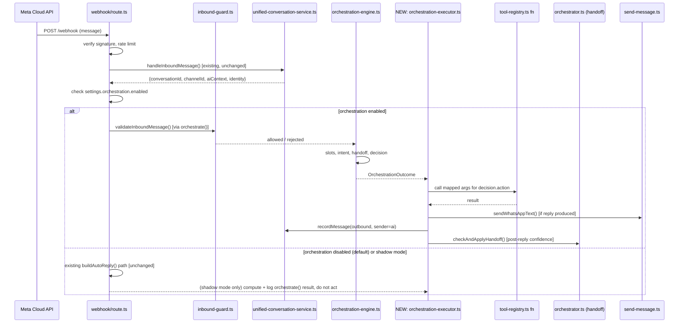

# Phase 1B — Architecture & Implementation Plan
**BookMySpaces CRM V3 — AI Orchestration Wiring**

Baseline: commit `c2384ea`, tag `phase-1a.1-complete`, branch `release/v1.0.0-rc2`.
Status: **planning only — no code in this document has been written or modified.**

---

## 1. Executive Summary

Phase 1A.1 built and hardened a complete orchestration *foundation* — slot memory, intent detection, a decision table, a tool registry, an inbound guard, and an `orchestrate()` engine that ties them together — as pure, tested, unwired functions. Nothing calls `orchestrate()` today. Customer-facing behavior is exactly what it was before Phase 1A started.

Phase 1B's job is narrower than it sounds: **wire the existing foundation into one real channel, end to end, behind a killswitch, without redesigning anything Phase 1A already decided.** The investigation below found the reason this needs to be done carefully rather than just "add an import": the codebase currently runs **three separate, overlapping inbound pipelines** for WhatsApp, and two competing decision mechanisms for what to say next. Phase 1B's actual scope is to pick one path, migrate the real value out of the other two, and retire them — not to add a fourth.

Recommended scope for Phase 1B: **WhatsApp only.** Website Chat, Facebook, and Instagram stay untouched, exactly as every prior phase instructed. WhatsApp is chosen because it is the only channel with a live, fully-wired AI reply loop today, which makes it both the highest-value target and the one with the most existing behavior to protect.

Recommended mechanism: a new, thin **Orchestration Executor** — the one piece of code Phase 1A explicitly left out on purpose (`orchestration-engine.ts`'s own header: "it never calls that function — executing the chosen tool is left entirely to the caller"). This is Phase 1B's main net-new component. Everything else is rewiring existing calls behind a flag.

Rollout mechanism: a new `settings.orchestration.enabled` flag (mirrors the existing `settings.ai.autoHandoff` pattern already in `settings-service.ts`), defaulting to `false`, with a **shadow mode** stage first (compute the orchestration decision on every real message, log it, act on nothing) before any customer ever receives a reply generated through this path.

---

## 2. Current Architecture Review

This section is the load-bearing part of the plan — every later section assumes these findings.

### 2.1 Three parallel inbound pipelines exist today

**Pipeline A — live, inline in the webhook** (`src/app/api/whatsapp/webhook/route.ts`)
Every real inbound WhatsApp message goes through this and only this path today:
`POST` → signature/rate-limit checks → `handleIncomingMessage()` → `buildAutoReply()` (hardcoded keyword matching: "book"/"availability", "price"/"rate", "cancel", else a static fallback) → `sendWhatsAppText()` → `persistConversation()` (writes the legacy `conversations` table) → fire-and-forget `syncToUnifiedConversationPlatform()` (mirrors into `unified_messages` via `handleInboundMessage()` from `unified-conversation-service.ts`, non-fatal).

This is a real, working, deployed reply loop. It has no intent detection, no slot memory, no decision table, no lead qualification funnel, and does not use the `leads.event_type/event_date/guest_count` fields the rest of the CRM depends on.

**Pipeline B — built, never called** (`src/services/whatsapp/process-inbound.ts`)
`processInboundMessage()` is a complete, more sophisticated pipeline: idempotency check against `whatsapp_messages.whatsapp_message_id` (a real unique constraint — actual duplicate-delivery detection, which Pipeline A does not have at all), source-channel detection, lead resolution, `whatsapp_conversations` get-or-create, message logging, activity log, `qualifyLeadFromMessage()` (writes `ai_score`/`lead_temperature`/`urgency_level` — fields several dashboards already read), `runAutoPackageRecommendation()`, a mirror into the Unified Conversation Platform, and `processAutoResponse()` (`auto-responder.ts`) — a *second*, hardcoded state machine keyed on `ConversationState` (`NEW_INQUIRY → WAITING_FOR_EVENT_TYPE → WAITING_FOR_EVENT_DATE → WAITING_FOR_GUEST_COUNT → QUALIFIED → HANDOFF_TO_OPERATOR`), each state driving one fixed template message and one `leads` column write.

Grepping the whole `src/` tree confirms `processInboundMessage()` is imported nowhere except its own file and referenced only descriptively in `auto-responder.ts`'s neighborhood. **It is dead code in production today** — fully built, unit-testable, never reachable from a live request. This matches the "process-inbound.ts: built but not yet connected" gap flagged during the Phase 1A.1 review.

**Pipeline C — Phase 1A.1's foundation, never called** (`src/lib/ai/orchestration-engine.ts`)
`orchestrate()` — the subject of the entire Hardening Sprint. Guard-checked, conflict-aware slot merge, intent detection, decision table, tool lookup. Returns a decision and a tool reference; executes nothing. Not imported by the webhook, by `process-inbound.ts`, or by anything else.

### 2.2 Two competing "what do we say next" mechanisms

`auto-responder.ts`'s `processAutoResponse()` and `decision-table.ts`'s `decideNextAction()` both answer the same question but disagree on method and scope:

| | `auto-responder.ts` (Pipeline B) | `decision-table.ts` (Pipeline C) |
|---|---|---|
| Input | `conversation.current_state` only | state + missing slots + intent + confidence + handoff + inventory/proposal/lead flags |
| Output | one hardcoded template string per state | one of 13 actions, each mapped to a real function in `tool-registry.ts` |
| Intent awareness | none — a "what's your price" reply mid-funnel gets the next funnel question, not an answer | `price_request` intent is recognized at any point via `intent-detector.ts` |
| Handoff | one-shot at `WAITING_FOR_GUEST_COUNT → QUALIFIED` transition, always | continuous — regex triggers (`orchestrator.ts`) plus confidence threshold, at any turn |
| State ownership | writes `whatsapp_conversations.current_state` directly | stateless; caller supplies `conversationState`, decides nothing about persistence |

These are not two views of the same logic — `auto-responder.ts` cannot express "customer asked about price while still mid-funnel" at all; `decision-table.ts` has no funnel-progression concept ("ask for the next missing slot in a fixed order") built in, since `collect_missing_information` is one action, not four sequential ones. Phase 1B has to reconcile this explicitly (Section 4.3), not silently pick a side.

### 2.3 Tool registry gaps (already flagged in `tool-registry.ts`'s own header)

Three of the 13 `OrchestrationAction`s have no dedicated function and are currently registered against `chatWithAI()` as a documented stopgap:

- `ask_question` / `collect_missing_information` — the natural implementation is `auto-responder.ts`'s own `MESSAGES` templates (`ASK_EVENT_DATE`, `ASK_GUEST_COUNT`, etc.), but that object is module-private today.
- `notify_staff` — the natural implementation is `auto-responder.ts`'s `notifyOperator()` (reads `notification_settings.daily_summary_whatsapp`, sends a WhatsApp alert), also module-private. `tool-registry.ts` currently points this at `enqueueMessage()` (`queue.ts`) instead, which is a real primitive but was never built for this purpose.

### 2.4 What the Executor problem actually is

`orchestrate()` returns `{ decision: { action, reason }, tool: { fn, sourceModule, ... } }`. None of the 13 actions' underlying functions share a call signature — `checkAvailability()` wants a property/date range/guest count, `getActivePackagePrices()` wants pricing criteria, `createProposalFromReservation()` wants a reservation id, `captureLeadWithJourney()` wants a full lead-detail payload, `applyHandoff()` wants a conversation id and reason, `chatWithAI()` wants a prompt/history. `orchestrate()` deliberately does not build these argument objects — nothing in Phase 1A does. **This mapping is entirely new code**, is the single largest unknown in this plan, and is scoped in Section 6.

### 2.5 Idempotency / replay data available today

`inbound-guard.ts` requires the caller to compute `isDuplicateDelivery` / `isReplayEvent`. Today, the only real idempotency store that exists is `whatsapp_messages.whatsapp_message_id` (Pipeline B, unique constraint). Pipeline A (live) has no idempotency check at all — a Meta webhook redelivery today would generate a second AI reply and a second `conversations` write. `unified_messages.external_message_id` exists as a column but has no unique constraint today (confirmed against migration 012 below) — this needs one for the guard's duplicate check to be enforceable rather than advisory.

---

## 3. Functional Scope

**In scope for Phase 1B:**
- Wire `orchestrate()` into the live WhatsApp inbound path via a new Orchestration Executor, behind `settings.orchestration.enabled` (default off) and a shadow-mode stage.
- Consolidate the three pipelines into one canonical path (Section 4.3): the Unified Conversation Platform (`unified_conversations`/`unified_messages`) becomes the system of record for AI-handled conversations; `process-inbound.ts`'s valuable, never-wired logic (idempotency semantics, auto-qualify, auto-package-recommendation) is folded into the new path; `auto-responder.ts`'s templates are exported and reused, not reimplemented.
- Fill the three tool-registry gaps with real functions (Section 6.3).
- Build the action → arguments mapping for all 13 actions (Section 6).
- Add a unique constraint + duplicate/replay detection query feeding `inbound-guard.ts`.
- Wire post-reply confidence handoff (`checkAndApplyHandoff`) after every `answer_immediately`/`ask_question` reply.
- Full test coverage for the Executor and the new mapping layer; no reduction in existing coverage.

**Explicitly out of scope (unchanged from every prior phase's constraints):**
- Website Chat, Facebook, Instagram, Google Business, LinkedIn, SMS — no changes.
- No redesign of `slot-memory.ts`, `decision-table.ts`, `tool-registry.ts`, `inbound-guard.ts`, `orchestration-engine.ts`'s internals — Phase 1A.1 is frozen baseline per the finalization instruction.
- No new AI model, no new LLM provider, no prompt-engineering changes to `chatWithAI()`.
- No UI redesign — the existing CRM/Unified Inbox screens are out of scope beyond what's needed to observe the new pipeline (Section 7).
- Legacy `conversations` table and `whatsapp_conversations`/`whatsapp_messages` tables are not dropped in this phase — deprecated in place, dual-write during migration (Section 5.3), removed in a later phase once confidence is established.

---

## 4. Technical Architecture

### 4.1 Target end-to-end flow (WhatsApp, orchestration enabled)



### 4.2 New component: Orchestration Executor

`src/lib/ai/orchestration-executor.ts` (new file). Single exported function, e.g. `executeOrchestration(outcome: OrchestrationSuccess, ctx: ExecutorContext): Promise<ExecutorResult>`. Responsibilities, and only these:
- Look up the argument-builder for `outcome.decision.action` (Section 6's mapping table) and call `outcome.tool.fn(...)`.
- Normalize every tool's result into one `ExecutorResult` shape (`{ replyText: string | null, sideEffectsApplied: string[] }`) so the caller doesn't need per-action branching.
- If `replyText` is non-null: send it (channel-specific `send*` function, injected — not imported directly, so this file stays channel-agnostic for a future Website Chat wiring) and record it via `recordMessage()`.
- Run `checkAndApplyHandoff()` after any AI-generated reply (mirrors what the existing chat route already does — not new behavior, just newly reachable from WhatsApp).
- Never itself decides *what* to do — that remains `orchestrate()`'s exclusive job, preserving Phase 1A's core boundary ("the orchestration engine must never contain business logic" — the Executor doesn't either; it only executes what was already decided).

This file is the only genuinely new business-logic file Phase 1B introduces. Everything else is either configuration (the flag), a data-shape addition (the action→args mapping, which is declarative, not logic), or exporting an existing private object.

### 4.3 Pipeline consolidation decision

**Recommendation: the Unified Conversation Platform becomes the single system of record.** Concretely:

1. `handleIncomingMessage()` in the webhook route keeps doing exactly what it does today (`buildAutoReply`, legacy `conversations` write) **only when `settings.orchestration.enabled` is false** — this is the safety net, identical to current production behavior, and is the fallback if Phase 1B needs to be instantly reverted.
2. When enabled, the webhook route calls `unified-conversation-service.ts`'s existing `handleInboundMessage()` (already built, already returns `aiContext`) to ingest the message and get a `conversationId`, then passes that `aiContext` plus the mandatory contract fields into `orchestrate()`, then hands the outcome to the new Executor.
3. `process-inbound.ts`'s unique value is preserved, not deleted: `qualifyLeadFromMessage()` and `runAutoPackageRecommendation()` calls move into the new path (called from the webhook route or the Executor, same as `process-inbound.ts` already calls them) so that value isn't lost when Pipeline B is retired. The idempotency pattern (`whatsapp_message_id` unique constraint) is replicated onto `unified_messages.external_message_id` (Section 5.1) rather than kept as a second table.
4. `auto-responder.ts`'s `MESSAGES` object is exported (Section 6.3) and reused by the `ask_question`/`collect_missing_information` tool-registry entries. `processAutoResponse()` and `advanceConversationState()` themselves are left in place, untouched, but stop being called once orchestration is enabled for a given conversation — they remain the fallback implementation as long as the flag is off.
5. `process-inbound.ts` and the webhook's `buildAutoReply`/`persistConversation` are marked deprecated (comment only) in this phase, not deleted — actual removal is a Phase 1C cleanup once the new path has run in production long enough to trust.

### 4.4 Feature flag & rollout stages

New `AISettings`-sibling section (mirrors existing pattern in `settings-service.ts`):
```ts
export interface OrchestrationSettings {
  enabled: boolean        // master switch, default false
  mode: 'shadow' | 'active'  // shadow: compute + log only; active: executes
  channels: ChannelType[] // which channels this applies to, e.g. ['whatsapp'] initially
}
```
Stage 1 — Shadow mode, 100% of WhatsApp traffic: `orchestrate()` runs on every real inbound message, result logged to `ai_interaction_log` (existing table) with the action it *would* have taken, current pipeline (A) still handles the real reply. No customer-visible change. Purpose: validate decision quality and the guard's rejection behavior against real traffic before it can affect anyone.
Stage 2 — Active mode, internal test numbers only (a small allow-list of phone numbers in `OrchestrationSettings`, or reuse an existing test-mode convention if one exists in `send-message.ts`). Purpose: validate the Executor's argument-mapping and reply generation end to end on real (but controlled) conversations.
Stage 3 — Active mode, 100% of WhatsApp. Old Pipeline A code path stays in the file (dead when the flag is on) as the instant-revert fallback for at least one full release cycle.

---

## 5. Database Changes

### 5.1 `unified_messages` — add idempotency
```sql
ALTER TABLE unified_messages
  ADD CONSTRAINT unified_messages_external_message_id_unique
  UNIQUE (channel_id, external_message_id);
```
Nullable-safe: only enforced when `external_message_id IS NOT NULL` (use a partial unique index, since website chat or manually-created messages may have no external id):
```sql
CREATE UNIQUE INDEX IF NOT EXISTS unified_messages_channel_external_id_uq
  ON unified_messages (channel_id, external_message_id)
  WHERE external_message_id IS NOT NULL;
```
The webhook route (or the Executor) queries this before calling `orchestrate()` to compute `isDuplicateDelivery`, giving `inbound-guard.ts`'s existing check real teeth on the live path for the first time.

### 5.2 New table: `orchestration_decisions` (observability, shadow mode requires this)
```sql
CREATE TABLE IF NOT EXISTS orchestration_decisions (
  id UUID PRIMARY KEY DEFAULT gen_random_uuid(),
  conversation_id UUID REFERENCES unified_conversations(id),
  message_id UUID REFERENCES unified_messages(id),
  mode TEXT NOT NULL CHECK (mode IN ('shadow', 'active')),
  action TEXT NOT NULL,
  reason TEXT NOT NULL,
  had_conflicts BOOLEAN NOT NULL DEFAULT false,
  conflicts JSONB,
  executed BOOLEAN NOT NULL DEFAULT false,
  created_at TIMESTAMPTZ NOT NULL DEFAULT now()
);
```
This is what makes shadow mode actually reviewable — without it, "log it" has nowhere durable to go besides free-text application logs. Also the natural home for `slot-memory.ts`'s `SlotConflict[]` output (`conflicts.resolutionRequired: true`) — today nothing persists these; Phase 1B is the first place a conflict actually needs to be seen by a human before being written back to `leads`.

### 5.3 Dual-write period
No column drops, no table drops. `leads` continues being written by both `auto-qualify.ts` and (once wired) the same calls from the new path — same columns, same writer functions, just a different caller. `conversations` (legacy) keeps being written only while `orchestration.enabled = false`, per Section 4.3.

---

## 6. API Design — the Action → Arguments Mapping

This is Phase 1B's core new logic. `orchestrate()` returns an action name; the Executor needs to build real arguments for the corresponding `tool-registry.ts` function. One row per action:

| Action | Tool fn | Argument source |
|---|---|---|
| `handoff_to_human` | `applyHandoff` | `conversationId` (from context), `reason` (from `decision`), `leadId` |
| `collect_missing_information` | `chatWithAI` → **new**: `askForSlot(slots.missingSlots[0])` | first missing slot, mapped to the matching exported `MESSAGES` template (Section 6.3) |
| `ask_question` | same as above | same mechanism; distinguished from `collect_missing_information` only by whether slots are missing or the intent itself is unclear with slots complete |
| `check_room_availability` / `check_banquet_availability` | `checkAvailability` | `slots.slots.eventDate`, `slots.slots.guestCount`, an inventory item id resolved from `inventoryCategory` + property (needs a small new lookup — property/room selection isn't in slot memory today; **flagged as an open question, Section 11**) |
| `generate_quotation` | `getActivePackagePrices` | `slots.slots.guestCount`, `slots.slots.eventType` as filter criteria |
| `recommend_package` | `runAutoPackageRecommendation` | `leadId` only (function already self-contained, per its own existing signature) |
| `generate_proposal` | `createProposalFromReservation` | requires a `reservationId` — **does not exist at this point in the pipeline** (no reservation has been created yet); Phase 1B must either (a) call `checkAvailability`/create-reservation first when this action fires with no reservation on file, or (b) treat this as a known gap and route to `notify_staff` instead until a real reservation-creation step is added. Recommendation: (b) for Phase 1B, revisit in Phase 1C once reservation creation from a conversation is itself designed. |
| `create_lead` / `update_lead` | `captureLeadWithJourney` | `slots.slots` (event type/date/guest count/budget), `leadId`/phone/channel identity |
| `schedule_follow_up` / `notify_staff` | `enqueueMessage` (current) → **new** dedicated functions (Section 6.3) | recipient (customer for follow-up, operator number from `notification_settings` for staff), message text |
| `answer_immediately` | `chatWithAI` | `aiContext`, `message` — this is the one action whose tool already has the right shape today (it's the existing chat route's own call pattern) |

### 6.1 Design principle for the mapping layer
Each row above becomes one small, individually testable function in a new `src/lib/ai/action-arguments.ts` (pure where possible, same discipline as `slot-memory.ts`) — not one large branching function in the Executor. This keeps the Executor itself thin and keeps each action's argument-building logic reviewable and unit-testable in isolation, matching the rest of this codebase's existing pattern of small, single-purpose modules.

### 6.2 `generate_proposal` gap — recommendation in detail
This is the single biggest unresolved dependency found during this review. `createProposalFromReservation()` needs a reservation id; nothing between `decideNextAction()` returning `generate_proposal` and this point has created one. Two options, neither implemented in Phase 1B:
- **Deferred (recommended):** downgrade `generate_proposal` to `notify_staff` at the Executor level whenever no reservation exists yet, with a clear log reason (`'generate_proposal requested but no reservation on file — routed to staff'`), so a human creates the reservation manually today. Zero new booking-creation logic in Phase 1B.
- **Full automation (Phase 1C candidate):** build a `createReservationFromSlots()` step that runs `checkAvailability` then creates a reservation before calling `createProposalFromReservation`. Bigger, riskier, explicitly out of scope here.

### 6.3 New exports required (no behavior change to the functions themselves)
- `auto-responder.ts`: export `MESSAGES` (or a subset — `ASK_EVENT_DATE`, `ASK_GUEST_COUNT`, a new `ASK_EVENT_TYPE` to complete the set since `GREETING` currently doubles as the event-type ask) and `notifyOperator()`. Pure export changes — no logic touched, satisfying the "reuse everything that already exists" rule from every prior phase.
- These become the real implementations behind `ask_question`/`collect_missing_information`/`notify_staff` in `tool-registry.ts`, replacing today's documented `chatWithAI()`/`enqueueMessage()` stopgaps — this closes all three `knownGap` entries `listKnownGaps()` currently reports.

---

## 7. Frontend / UI Changes

Minimal, observability-only:
- Unified Inbox (wherever it currently reads `unified_conversations`/`unified_messages`): surface `ai_active` (already a column) and, new, a small badge sourced from `orchestration_decisions` showing the last action taken — no new screen, an addition to an existing list/detail view.
- A read-only shadow-mode review view (could be a simple filtered query/table, not a new page) so whoever is validating Stage 1 can see `orchestration_decisions` rows next to what Pipeline A actually sent, side by side, without a database client. Could be shipped as a Cowork artifact instead of new CRM UI if that is a faster/lower-risk path — flagged as an option, not a requirement.
- No changes to any customer-facing surface in this phase (there are none for WhatsApp — it's a webhook, not a page).

---

## 8. AI Integration Plan

No new model calls beyond what already exists. `chatWithAI()` is reused unchanged for `answer_immediately`. The only "new" AI-adjacent behavior is that `ask_question`/`collect_missing_information` move from a live LLM call path (today, if they hit `chatWithAI()` per the tool-registry stopgap — though unreachable in production today since nothing calls `orchestrate()` yet) to deterministic templates (Section 6.3) — this is a **cost and latency improvement**, not a regression: the funnel-progression questions don't need an LLM at all, matching `auto-responder.ts`'s original design philosophy ("Deterministic, rule-based... NO open-ended GPT").

`estimateConfidence()`/`checkAndApplyHandoff()` (existing, untouched) get their first real WhatsApp call site via the Executor (Section 4.2) — this is net-new *reach*, not net-new *logic*.

---

## 9. Security Review

- **Idempotency enforcement becomes real** (Section 5.1) — today's live path (Pipeline A) has none; this is a net security/correctness improvement, not just parity.
- **Message-length bound** (`inbound-guard.ts`'s `MAX_MESSAGE_LENGTH = 4000`) becomes enforced on the live path for the first time.
- **PII in `orchestration_decisions`:** the `conflicts` JSONB column can contain a customer's corrected guest count/budget/etc. Same sensitivity class as `leads` itself — apply the same RLS policy pattern already used on that table (every other table in migration 012 already does `ENABLE ROW LEVEL SECURITY`; match it).
- **Kill-switch integrity:** `settings.orchestration.enabled` must fail closed — if the settings read fails for any reason, the Executor path must not run (default to Pipeline A), matching the existing defensive pattern in `orchestrator.ts`'s `applyHandoff` (try/catch, never throws, logs and continues).
- **No change to** signature verification, rate limiting, or the `WHATSAPP_APP_SECRET`/`WHATSAPP_WEBHOOK_VERIFY_TOKEN` handling in the webhook route — those stay exactly as reviewed in the Hardening Sprint.

---

## 10. Testing Strategy

- `orchestration-executor.ts`: unit tests per action, mocking `tool.fn` — verify the right arguments are built (Section 6 mapping) and the right normalized `ExecutorResult` comes back. Follows the same `vi.mock()` hoisting discipline already fixed in `orchestration-engine.test.ts` (typed optional-parameter mock functions, never a bare reference inside the factory).
- `action-arguments.ts`: pure-function unit tests, one suite per action, same style as `slot-memory.test.ts`.
- Shadow-mode integration test: feed a realistic WhatsApp payload through the full route with `orchestration.enabled=true, mode='shadow'` and assert (a) `orchestration_decisions` gets a row, (b) `sendWhatsAppText` is NOT called by the new path, (c) Pipeline A's existing reply still goes out unchanged.
- Active-mode integration test: same payload, `mode='active'`, assert the Executor's chosen path is what actually sends, and Pipeline A does not double-send.
- Regression guard: existing 320 Phase 1A.1 tests must stay green and untouched — Phase 1B adds tests, it does not edit `slot-memory.test.ts`, `decision-table.test.ts`, etc.
- No live WhatsApp sends in CI — same mocking boundary (`sendWhatsAppText`) already used in existing webhook-adjacent tests, if any exist, or established fresh here.

---

## 11. Open Questions / Risks Needing a Decision Before Implementation

1. **Room/property selection isn't in slot memory.** `checkAvailability` needs an inventory item id; `SlotValues` has `venue: string | null` (free text) but no resolved id. Needs either a small lookup step or an explicit decision that Phase 1B's `check_*_availability` wiring is partial (works when venue is unambiguous, else falls back to `notify_staff`).
2. **`generate_proposal`'s missing reservation dependency** (Section 6.2) — recommend deferring to `notify_staff`; needs sign-off since it changes what "ready to book" actually delivers to the customer today (a human follow-up, not an instant proposal).
3. **Test-number allow-list mechanism for Stage 2** — does one already exist in `send-message.ts` or does it need to be built? Not confirmed in this review.
4. **Where does the shadow-mode review UI live** — CRM addition vs. a Cowork artifact vs. just direct DB queries for the pilot period? Lowest-risk answer is "direct queries only" for Stage 1, deferring any UI work.
5. **`asked_question`/`collect_missing_information` split** — right now `decision-table.ts` only ever returns `collect_missing_information` (Rule 4) when slots are missing; `ask_question` is registered but never produced (Section 2.3's third bullet already exists as a documented, deliberate Phase 1A gap). Phase 1B should decide whether to leave `ask_question` permanently unreachable or give it a real trigger (e.g., disambiguating between two matched inventory items) — not required for the WhatsApp wiring itself.

---

## 12. Implementation Plan (sequenced, each step independently shippable/revertable)

1. Add `OrchestrationSettings` to `settings-service.ts` (default `enabled: false`) — no behavior change, ships alone.
2. Add the `unified_messages` unique index (Section 5.1) and `orchestration_decisions` table (Section 5.2) migration — no behavior change, ships alone.
3. Export `auto-responder.ts`'s templates + `notifyOperator()` (Section 6.3) — no behavior change, ships alone.
4. Build `action-arguments.ts` with full unit test coverage — no wiring yet, ships alone, fully testable in isolation.
5. Build `orchestration-executor.ts` with full unit test coverage (mocked tools) — still not called from the webhook, ships alone.
6. Wire the webhook route: shadow mode only, `orchestration.enabled=true, mode='shadow'` in a staging/limited environment first. Verify `orchestration_decisions` rows look correct against real traffic for an agreed observation period.
7. Enable active mode for the Stage 2 test-number allow-list. Manually verify a handful of real conversations end to end.
8. Enable active mode for 100% of WhatsApp. Keep Pipeline A's code path intact and reachable via the flag for at least one full release cycle.
9. Only after sustained confidence: mark `process-inbound.ts` and the webhook's inline `buildAutoReply`/`persistConversation` deprecated in comments (Phase 1C: physical removal).

Each step above compiles, type-checks, lints, and passes the full test suite on its own — matching the same "fix one failure, rerun until green" discipline used throughout Phase 1A.1's own verification.

---

## 13. Readiness Assessment

| Area | Score (0-10) | Basis |
|---|---|---|
| Plan completeness | 8 | All 13 actions mapped; 2 open questions (Section 11) need a decision before Step 4 can be finished, not before Step 1 |
| Architectural risk | Medium | Consolidating 3 pipelines is the real risk, not the orchestration logic itself, which is already tested |
| Backward compatibility | High confidence | Flag defaults off; shadow mode adds zero customer-visible risk; Pipeline A remains the fallback through Stage 3 |
| New code surface | Small | One new file with real business logic (`orchestration-executor.ts`), one declarative mapping file (`action-arguments.ts`), two small migrations, two config additions, two export changes |
| Test strategy | Defined | Section 10; no existing test is modified, only added to |

**Is this plan ready to start implementation?** Yes, for Steps 1–5 (Section 12) — none of those depend on the open questions in Section 11. Step 6 (first shadow-mode wiring into the live webhook) should wait for an explicit decision on Section 11 items 1 and 2, since those affect what the Executor does with two of the 13 actions.

**No code has been written or modified as part of this document.** Awaiting approval to begin Step 1.
